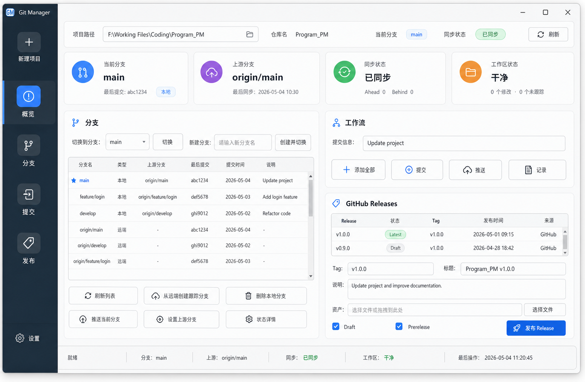

# Git Manager UI Concept

This document captures the generated UI concept for Git Manager and the
implementation direction used by the current sidebar-based interface.



## Design Direction

- Use a compact Windows desktop layout with a dark left navigation rail.
- Split work into focused areas: New, Overview, Branches, Commits, Releases.
- Keep operational controls dense, aligned, and predictable.
- Use equal-width cards and buttons where actions are grouped.
- Keep tables scrollable so long branch names, commit messages, and release
  metadata do not distort the layout.
- Treat release publishing as a tag-based GitHub release workflow with optional
  asset uploads.

## Suggested Screen Structure

- Header: project path, repository name, sync badge, refresh action.
- Sidebar: persistent navigation for major workflows.
- New: project path/name inputs, Git initialization option, and ModuleFiles
  template selection.
- Overview: repository status cards, repository configuration, and navigation
  shortcuts only. It intentionally does not duplicate every feature.
- Branches: branch selector, create-branch input, local/remote branch table,
  and remote/config actions.
- Commits: commit message field, add/commit actions, push/pull/fetch sync
  controls, and recent history / operation output.
- Releases: release table, tag/title/notes/assets fields, draft/prerelease
  options, and a primary publish action.

## Prompt Used

```text
Create a polished modern Windows desktop UI mockup for a software named
"Git Manager", a Git project manager GUI. Show one main app window at
1100x720 with a compact professional layout, suitable for Windows 11.
Use a narrow dark sidebar, focused cards, branch/commit/release workflows,
aligned forms, equal button sizes, visible scrollbars, and a restrained
professional productivity-tool style.
```
